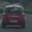
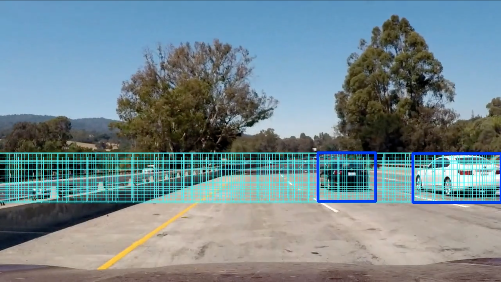
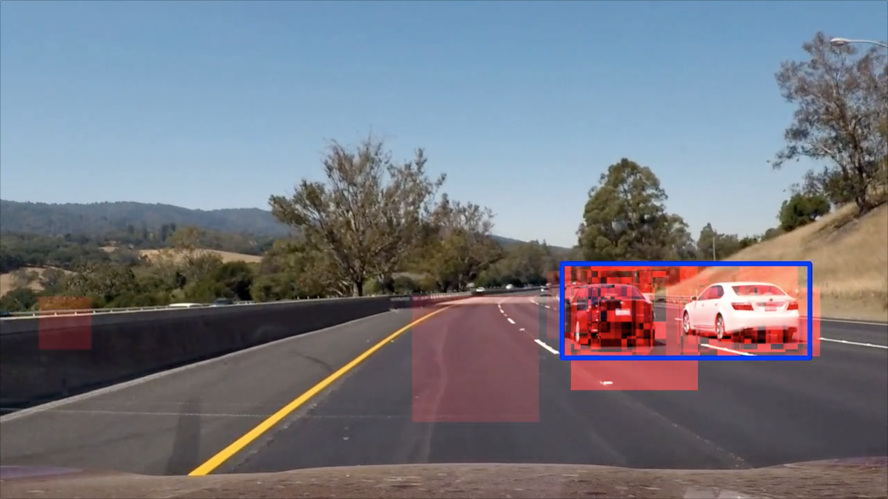
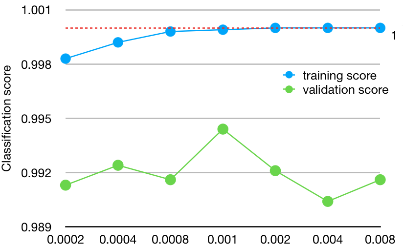

# Vehicle Detection Project

## Project structure

Project files can be found in [python](python) folder.

The file [main.py](python/main.py) is the entry point. It creates composite image features extractor in the function `create_image_features` and image classifier in the function `create_classifier`. The function `main` additionally creates a `HeatMap` instance, `SlidingWindowSearch` instance and `LabelsVisualization` instance. Then the function `process_video` is called to process the video file.

[video.py](python/video.py) contains a frame-by-frame video processor which applies the same transformation to each video frame. First it converts frame to YCrCb color space and then calls frame handler to process a frame.

[tracker.py](python/tracker.py) container `VehicleTracker` which is the class for frames processing. Its `process_frame` function invokes sliding window search algorithm and then calls `_visualize` to draw bounding boxes around detected vehicles, and optionally visualize frames and heat map.

[sliding_window.py](python/sliding_window.py) implements sliding window search algorithm. The class defines windows in the `WINDOWS` constant and provides `search` function which extracts features with the help of composite feature extractor and the calls classifier to detect cars.

[features.py](python/features.py) is the composite feature extractor. `ENABLED_FEATURES` allows to enable or disable each of spatial, color histogram and HOG features separately. The function `extract` extracts features from the entire image, while `extract_from_windows` extracts features from a list of windows.

[spatial.py](python/spatial.py), [color_hist.py](python/color_hist.py) and [hog.py](python/hog.py) implement classes to extract spatial, color histogram and HOG features respectively. Their functions `extract` and `extract_from_windows` return feature vector(s) for a single feature type.

[classifier.py](python/classifier.py) provides function `train` to train SVM classifier using labeled files and `predict` to classify a single image. It contains various options to customize training process, and pickles the trained model to speed up startup on subsequent program runs.

## Dataset and training

The training script uses vehicle and non-vehicle image files provided for the project. The data set contains 8792 vehicle images and 8968 non-vehicle images. The data set is well balanced.

Here is an example of a car image:

Below is an example of a non-car image:

The dataset is loaded by `Classifier._load_training_data` ([classifier.py](python/classifier.py)). The function calls `_load_all_files` to load all image files from vehicle and non-vehicle folders. It labels vehicles images with the label `1` and non-vehicle images with the label `0`. The function transforms loaded images to YCrCb color space and calls `self.image_features.extract` to extract all the features from each image.

Loaded data set is saved to file `data.p`. Subsequent executions load pre-processed data set from a single file which significantly decreases startup time.

After loading the dataset, `_load_training_data` shuffles records and scales features with the help of `StandardScaler.fit` and `StandardScaler.transform` calls. Then function `_split_data` splits the data into training set (80% of the data) and validation set (20% of the data).

The function `train` runs one of three training modes. In the *"tune"* mode the function `_train_tune_hyperparams` is called to auto-tune parameter `C` of the `LinearSVC` classifier by calling `GridSearchCV.fit`. In *"grid"* training mode a similar auto-tuning functionality is implemented, however this time `_train` is called in a loop with different values of hyperparameters. Finally, the mode *"train"* runs training on the data set using best known values of hyperparameters from `BEST_KNOWN_HYPERPARAMS` constant.

## [Rubric](https://review.udacity.com/#!/rubrics/513/view) Points

Here I will consider the rubric points individually and describe how I addressed each point in my implementation. 

### Histogram of Oriented Gradients (HOG)

The code for this step is contained in the [hog.py](python/hog.py) file. Its function `_get_features` extracts HOG features from a single image channel. The function uses `skimage.feature.hog` to extract the features. The function takes image channel as input as value as a boolean value `feature_vec` to indicate whether a feature vector should be returned by the function.

`_get_features` is called by `_get_channel_features` which extracts HOG features from all three image channels. The function returns the features in a 3-tuple which is later converted to a single feature vector by one of `extract` or `extract_from_windows` functions.

Function `extract` extracts HOG features from a single image. Depending on configuration, it can extract features from a single image channel or from three image channels.

`extract_from_windows` works in combination with the sliding windows algorithm. It takes two parameters. The first one `resized_cache` is a dictionary keyed by `scale` with values being scaled down images of a single video frame. Parameter `windows` is a list of search windows, each element contains 4 windows coordinates and the value of *scale*.

`extract_from_windows` uses an algorithm similar to sub-sampling to speed up processing. The list of windows contains windows of the same size, however image scale may be different for different windows. The function computes HOG for each image only once, storing it in `hog_cache` for the case when another window with the same scale is defined in `windows` list.

`HogFeatures` class allows to extract features from either of three image channels or from all channels. To support all use cases, `extract_from_windows` attempts to get HOG feature subset from each of the channels (variables `hog1`, `hog2` and `hog3`) and skips those that are not returned by `_get_channel_features` (their value is `None`). Finally extracted values are combined in a horizontal stack to form a feature vector.

### Spatial features

The code to extract spatial features is contained in [spatial.py](python/spatial.py) file. The function `SpatialFeatures.extract` resizes the image to 32x32 pixels size and reshapes all the pixels to a 1-dimensional vector.

### Color histogram features

The code to extract color histogram features is contained in [color_hist.py](python/color_hist.py) file. The function `ColorHistFeatures.extract` makes call to `np.histogram` to compute histogram value for each color channel separately. Features are aggregated in 32 bins evenly distributed in range 0-255. Computed histogram values are consolidated into a single vector with the help of `np.concatenate` call.

### Sliding Window Search

Sliding window search implementation is contained in [sliding_window.py](python/sliding_window.py) file and partially in [features.py](python/features.py). The class defines window search rules in `WINDOWS` constant, which contains a list of dictionaries. One dictionary entry specifies the rules for one size of window.

In order to run search with different window sizes, scale factor is computed in such a way that when image is resized, rectangle with sides of 64 pixels covers desired window area.

`n_windows` defines number of windows to fit in the image horizontally. Scale factor is computed as `BASE_LENGTH * n_windows / IMAGE_WIDTH`. When image is rescaled using computed scale factor its width becomes equal to `BASE_LENGTH * n_windows` and exactly `n_windows` fit in the image horizontally.

For example, if `n_windows` is set to 10, image is resized to the width of 640 pixles. In this case 10 adjacent windows with side 64 pixels can fit horizontally.

`overlap` defines overlap fraction. E.g. `0.25` means that window slides by 1/4 of window width and height.

`y_start` and `y_stop` define top and bottom borders of search area in the source (non-resized) image. Top part of the image contains sky where cars are not expected to be found, therefore `y_start` is set to 390 or higher. Bottom part contains car hood, so `y_stop` is set to 600 or lower. Also, search with small window sizes makes more sense in the vicinity of horizon where smaller cars are expected to be found. Search with larger window sizes can be performed farther from the horizon because cars that are closer to the camera appear in the lower part of the image.

The function `_build_window_list` builds a list of all search windows used by the algorithm. The list is computed once per program execution and stored in `self.windows` variable. Function `search` initializes a new heatmap frame and iterates over the list of windows. On each iteration it calls function `self.features.extract_from_windows` to get feature vector from a frame, then calls `self.classifier.predict` to get classifier prediction (1 for car, 0 for no car). If classifier predicts a car, `search` adds window bounding box to the heatmap.

Below is a video frame with all search windows drawn over it.

### Composite feature extraction

Composite feature extraction is performed by `ImageFeatures` class from [features.py](python/features.py). The class extracts three types of features: spatial, color histogram and HOG features.

The class implements two search functions `extract` and `extract_from_windows`. The former one is invoked by classifier during training step when whole images are classified. It calls `spatial.extract`, `color_hist.extract` and `hog.extract` to extract features of different types from the image and then calls `_merge_features` to create a consolidated feature vector.

The other function `extract_from_windows` is called by sliding window search algorithm. The function runs in two steps. On the first step it iterates over the list of windows, resizes the image and calls `spatial.extract` and `color_hist.extract` to get spatial and color histogram features. These features can be efficiently extracted from a resized image. Each image is resized to a particular scale only once, and then resized image is stored in `resized_cache` variable. On subsequent iterations image is retrieved from the cache and reused. This way, when window of the same size is sliding over the same image, the same resized copy is used for all window positions. On the second step the function invokes `hog.extract_from_windows` to let HOG feature extractor apply sub-sampling. Finally features are merged in a list of vectors, one record per image.

### Heatmap

Heatmap aggregation is performed by `Heatmap` class from [heatmap.py](python/heatmap.py) file. The class maintains a list of heat maps, one per video frame. All the heat maps are summed up and the final heat map is used for vehicle detection.

The function `new_frame` shifts heat maps stored so far, removing the oldest map. A new empty map is added as the last element. This new map is used to accumulate data. Function `add` marks specified bounding box as containing a car by increasing heatmap value by 1.

Function `get_labels` calls `_get_aggregate` to sum up all the maps and then calls `label` from scipy to label located image areas. `_get_aggregate` returns an empty map if less then `NUM_FRAMES` video frames were processed.

Function `get_visualization` returns either aggregated heat map or the most recent heat map depending on configuration.

An example of visualized heat map is provided below. The image shows heat map with two false positives, but they are not picked by `label` function because these are outliers while vehicle areas have more detections from different window sizes and locations, which is shown with colors of higher intensity.

### Video Implementation

Here's a [link to my video result](output_video/project_video.mp4).

## Exploration

I have experimented with different settings and different values of hyper-parameters to get the best accuracy of the algorithm.

For classification task, I tried linear and rbf SVM classifiers, decision tree classifier and naive Bayessian classifier. Linear SVM gives the best accuracy.

I tried different values of regularization parameter `C` of `LinearSVC` class, from 0.0002 to 0.008. The value 0.001 gives the best accuracy without overfitting. The graph below shows training and classification score for different values of `C`.

I tried different window sizes for spatial and color histogram feature extraction: 8, 16, 32 and 48. Windows size 32 provides the best results.

For HOG feature extraction, I experimented with different color spaces: RGB, HSV, LUV, HLS, YUV and YCrCb. YCrCb produces the best results, classification accuracy is lower when image is converted to different color spaces. I tried different values of parameter to `hog` function: `orient` — 6, 9, 12, `pix_per_cell` — 5, 8 and 11, `cell_per_block` — 1, 2 and 3, as well as extracting HOG features from different image channels.

Parameters I picked eventually are 12 orientation bins, 11 pixels per cell, 2 cells per block and HOG features extracted from all three image channels.

I have experimented with different window sizes, tried to remove some sizes or add large windows. Removing sizes does not improve accuracy, while adding larger window sizes increases number of false positives.

In the final pipeline I use relatively narrow slice of the frame to run sliding window search. There are two reasons for that, first - cars in the video appear only in that area, second - running sliding window search over a larger area increases the number of false positives. See illustration below. Larger search area results in a false positive in the middle of the frame which is not detected in the final video produced with a smaller search area.

---

### Discussion

The project suffers from relatively high number of false positives. Some of them are detected on multiple consecutive frames and cannot be removed by `HeatMap`. I have tried various combination of hyper-parameters, training accuracy is quite high and there is no room for classifier to substantially improve training accuracy with the same set of features and the same data set.

Possible strategies to improve accuracy could be to try a different classifier, e.g. a convolutional neural network or to try training the classifier on a larger data set.
